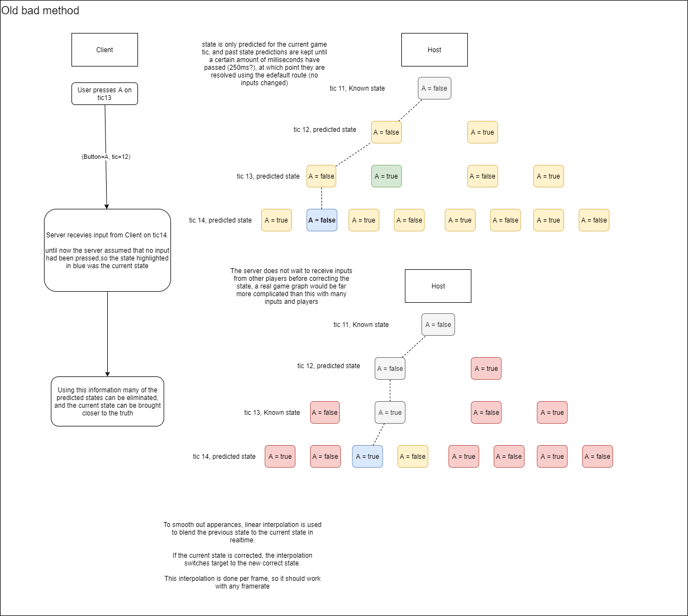
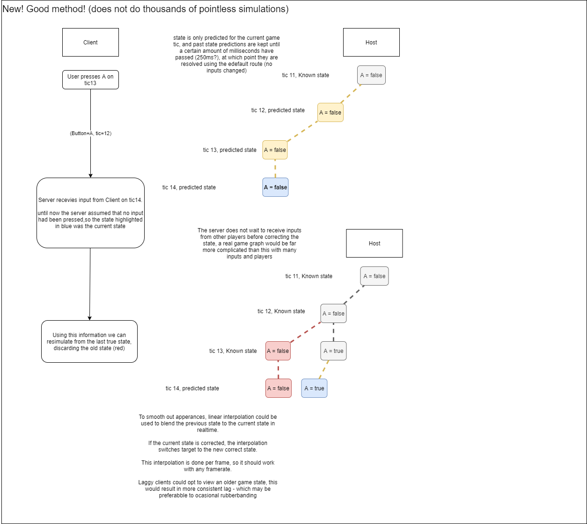

This repository includes:
* __A Server__, which serves the client files via http, provides websocket connections, and runs the server netcode
* __A Client__, which runs the client netcode, creates events from keypresses, and displays ping

also this readme is likely out of date, sorry.

### Where it is at
In theory it is mostly working, I want to develop this into a full demo game that you can play now, I'll discover thousands of issues doing that.

### Notes
I sortof invented this before realizing that GGPO was a thing, this is likely something like that.

These diagrams show what I was originally planning to do, and what I'm trying to do.

